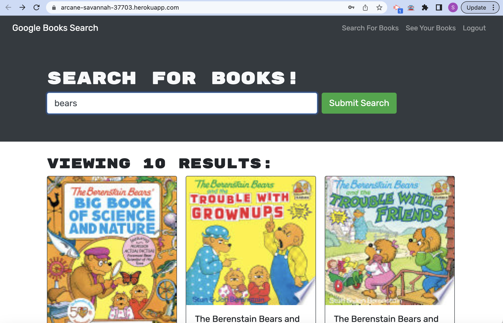

# MERN Book Search Engine (Refactor)

## Description

This project refactors and existing Book Search Engine (using Google Books) to use Apollo Client/GraphQL to interface with a MongoDB database on an Apollo Server/NodeJS/Express backend.

The use case for the application itself is to enable users to find and save books they are interested in.

The intent is to apply our learning of MERN concepts, GraphQL, Apollo Server and Client, and code refactoring to a functional MERN application.

- What did you learn?

LESSONS LEARNED: I found how little I understood from the class modules, and it took a significant amount of additional reading and trial and error to get functionality working through GraphQL.  I was able to gain a better understanding of how to use GraphQL and Apollo to implement standardized client/server data interchange.  GraphQL provides a single interface for all data, rather than needing to use multiple web URLs/routes for various functionalities. 

## Table of Contents (Optional)

If your README is long, add a table of contents to make it easy for users to find what they need.

- [Installation](#installation)
- [Usage](#usage)
- [Credits](#credits)
- [License](#license)

## Installation

What are the steps required to install your project? Provide a step-by-step description of how to get the development environment running.

- Clone the repository
- From a terminal, in the top-level directory run `npm run install`
- To run both client and server simultaneously, run `npm run develop`
- The client web-page should open automatically in your default browser.

## Usage

- On the homepage, you can search for books.  You must create an account and login to save books to a list.
- Click the `Login/Signup` link to create a new account and log in.  Login using the email address and password specified during signup.
- In the search results, click the `Save Book` link under any book to save it to your list.
- Click `See your books` to view the list of books. (NOTE: This feature is currently not working)
- Remove books: This feature is currently not working.

**Deployed App**
See the app on [Heroku](https://arcane-savannah-37703.herokuapp.com/)

## Credits

The main code for this project was provided through the [University of Arizona Coding Bootcamp](https://bootcamp.ce.arizona.edu/coding/landing-ftpt-b5/?s=Google-Brand_Tier-1_&dki=Become%20a%20Computer%20Programmer%20%7c%20Learn%20Coding%20Online&pkw=%2Buniversity%20%2Bof%20%2Barizona%20%2Bprogramming%20%2Bclass&pcrid=454927307418&pmt=b&utm_source=google&utm_medium=cpc&utm_campaign=GGL%7CUNIVERSITY-OF-ARIZONA%7CSEM%7CCODING%7C-%7CONL%7CTIER-1%7CALL%7CBRD%7CBMM%7CPrimary%7CEducation&utm_term=%2Buniversity%20%2Bof%20%2Barizona%20%2Bprogramming%20%2Bclass&s=google&k=%2Buniversity%20%2Bof%20%2Barizona%20%2Bprogramming%20%2Bclass&utm_adgroupid=107923634044&utm_locationphysicalms=9030261&utm_matchtype=b&utm_network=g&utm_device=c&utm_content=454927307418&utm_placement=&gclid=Cj0KCQiA6fafBhC1ARIsAIJjL8mLWAboUgYDwfJqT5b35floBBh7oEFr5r0DHpaOja9zUNY3ah_IXb4aAgSsEALw_wcB&gclsrc=aw.ds).

## License

The last section of a high-quality README file is the license. This lets other developers know what they can and cannot do with your project. If you need help choosing a license, refer to [MIT License](/LICENSE).

